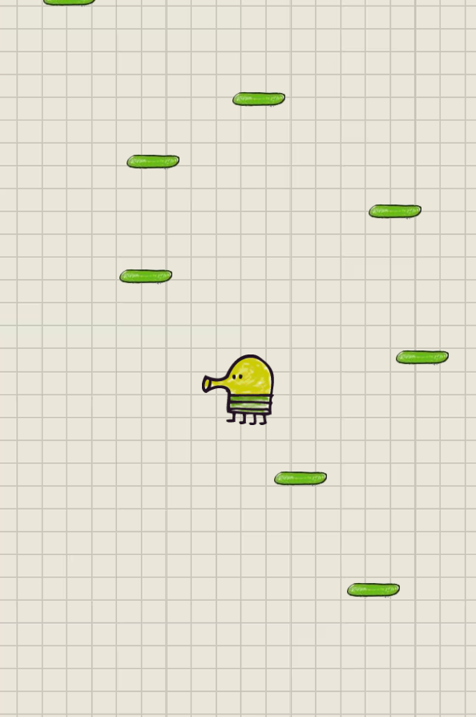
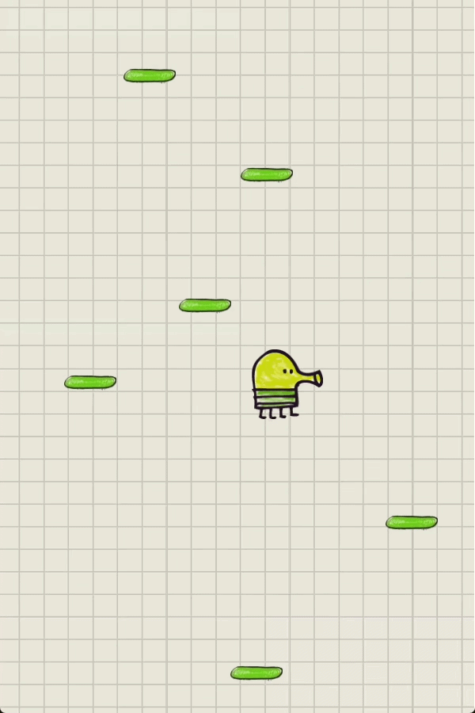
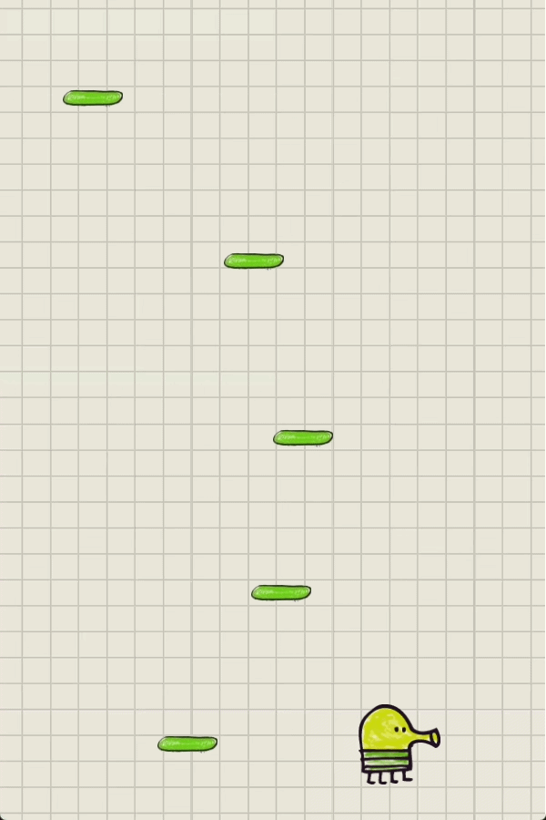

# 🚀 Doodle Jump Clone (MVP)

<p align="center">
  
</p>

### 📖 Project Overview
A high-performance **Doodle Jump** clone written in C++, powered by a custom-built **Entity Component System (ECS)** and the **SFML** library. 

This project was specifically designed to demonstrate **Data-Oriented Design (DOD)** principles and efficient game engine architecture, focusing on memory locality and cache-friendly systems.

---

## 🛠 Tech Stack
* **Language:** C++20
* **Graphics & Audio:** SFML 2.6.x
* **Build System:** CMake
* **Architecture:** Custom ECS (Structure of Arrays, Bitsets for signature matching)

---

## ✨ Key Features
* ⚡ **Custom ECS Engine:** High-speed entity management using bitmasks for system filtering.
* ♾️ **Procedural Generation:** Infinite platform spawning with automated memory cleanup.
* 🏎️ **Data-Oriented:** Components are cache-aligned (SoA) to minimize CPU cache misses.
* 📂 **Asset Management:** A centralized resource manager (Singleton) for optimized texture and sound loading.

---

## 🎮 Visuals
<div align="center">
  
  
</div>

### Core Systems:
* **InputSystem:** Decouples raw SFML events from gameplay logic.
* **AnimationSystem:** Handles frame switching and sprite management based on input or state.
* **MovementSystem:** Updates positions and handles physics integration (including gravity and velocity).
* **CollisionSystem:** Implements precise AABB collision detection (interaction only on descent).
* **CameraSystem:** Smooth vertical-only camera tracking focused on player progression.
* **BoundarySystem:** Automated culling (deletion) of off-screen objects to maintain performance.

---

## 📂 Project Structure
* `components/` — Pure data structures (PODs: Position, Velocity, SpriteComponent).
* `systems/` — Logic layers that transform and process component data.
* `resources/` — Game assets (textures, fonts, and SFX).

---

## ⚙️ Build Instructions

### Requirements:
* Compiler with **C++20** support (GCC, Clang, or MSVC)
* **SFML 2.6.x** installed
* **CMake** 3.15+

### How to build:
```bash
# 1. Clone the repository
git clone [git clone https://github.com/aeriseek/DoodleJump.git](https://github.com/your-username/DoodleJump.git)
cd DoodleJump

# 2. Create build directory
mkdir build && cd build

# 3. Configure and build
cmake ..
cmake --build .
